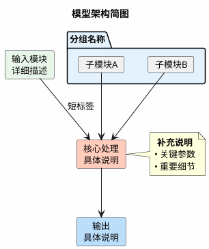

# 论文解析 Skill

将学术论文 PDF 转化为带有中文解读和模型架构图的 Markdown 笔记文件。

## 前置确认

在执行任何操作之前，如果用户未明确提供以下信息，必须逐一询问：

1. **分析模式**：用户想分析单个 PDF 文件，还是分析整个文件夹？
2. **源路径**：要分析的 PDF 文件路径（单个模式），或包含 PDF 论文的文件夹路径（文件夹模式）
3. **输出路径**：解析结果 md 文件的保存文件夹路径（建议不要与源文件夹相同）

### 路径解析规则（重要）

用户给出的路径可能是相对路径，解析时遵循以下规则：

- **绝对路径**：直接使用（如 `/mnt/d/papers/` 或 `D:\papers\`）
- **相对路径**：**以当前工作目录为基准**进行拼接，不要用其他目录作为基准
  - 例如工作目录是 `/mnt/d/obsidian_wiki/`，用户输入 `ObsidianRaw/AI/`，则解析为 `/mnt/d/obsidian_wiki/ObsidianRaw/AI/`
- **Win 反斜杠**：用户可能使用 `\` 作为路径分隔符（如 `论文\survey`），统一转换为 `/`

### 路径确认

收集完用户输入后，**必须将解析后的完整绝对路径展示给用户确认**，格式如下：

```
解析结果：
  源文件夹：/mnt/d/.../obsidian_wiki/论文/
  待分析文件：survey/xxx.pdf（相对子路径）
  输出路径：/mnt/d/.../obsidian_wiki/ObsidianRaw/AI/AI论文解析/
  输出文件：/mnt/d/.../ObsidianRaw/AI/AI论文解析/survey/解析-xxx.md

确认无误？Y/N
```

用户确认后再开始执行，不要推断或假设路径。

## 输出目录结构

输出文件夹中仅镜像**源文件夹内部的子目录结构**，源文件夹本身的名字不出现在输出路径中。

关键是计算 `相对子路径`：PDF 文件路径去掉源文件夹前缀后的部分（含子目录和文件名）。

例如：
- 源文件夹 `/mnt/d/obsidian_wiki/论文/`
- 文件 `/mnt/d/obsidian_wiki/论文/survey/paper.pdf`
- 相对子路径：`survey/paper.pdf`
- 输出文件 `{输出路径}/survey/解析-paper.md`

另一个例子：
- 源文件夹 `/mnt/d/obsidian_wiki/论文/`
- 文件 `/mnt/d/obsidian_wiki/论文/RL/ppo.pdf`（直接在源文件夹下，无子目录）
- 相对子路径：`ppo.pdf`
- 输出文件 `{输出路径}/解析-ppo.pdf`

如果目标子目录不存在，需先创建。

## md 文件格式

每个 md 文件使用以下结构：

```markdown
---
分析日期: 2026-05-08
源文件路径: {源文件夹名}/相对路径/paper.pdf
---

# 解析-{原PDF文件名}

## 论文解读

[研究生导师视角的通俗解读]

## 模型架构

[PlantUML 代码块，仅当论文有新模型架构时]
```

### 元信息说明

- `分析日期`：当前日期，格式为 YYYY-MM-DD
- `源文件路径`：PDF 文件相对于**源文件夹**的路径（包含子目录）。例如源文件夹是 `/data/论文/`，文件是 `/data/论文/survey/yolo.pdf`，则记录为 `survey/yolo.pdf`

此元信息用于后续判断论文是否已被解析过——如果 md 文件已存在，则直接跳过。

## 分析流程

### 步骤1：收集待分析文件

**单个文件模式：**
- 直接使用用户指定的 PDF 文件

**文件夹模式：**
- 递归遍历源文件夹及其所有子文件夹
- 收集所有 `.pdf` 后缀的文件（不区分大小写）
- 对每个 PDF 文件，检查输出文件夹中对应的 `解析-{原PDF文件名}.md` 是否已存在
- 已存在则跳过，不重复分析
- 列出待分析文件清单，告知用户总数和跳过数

### 步骤2：读取 PDF 并判断类型

对每个待分析的 PDF：

1. 使用 Read 工具读取 PDF
2. 判断 PDF 是否为扫描版（仅有图片，无可提取的文字层）：
   - 能读到文字内容 → 正常 PDF，继续步骤3
   - 读不到文字（全是图片）→ 告知用户"`{文件名}` 似乎是扫描版 PDF，没有可提取的文字层。是否需要使用 OCR 工具进行文字识别后再分析？"，等待用户决定。用户确认跳过则继续下一个文件。

### 步骤3：生成论文解读

用以下身份和语气分析论文：

> 假如你是研究生导师，用通俗易懂的语言告诉我这篇论文讲了什么？

解读应做到：
- 点明论文要解决什么问题（研究背景和动机）
- 说明核心方法是什么，创新点在哪
- 总结主要实验结果和关键结论
- 用生活化的类比帮助理解难懂的概念
- 避免大段堆砌专业术语，非用不可时顺带解释一句
- 篇幅适中，让非该领域的研究生也能读懂

将结果放在 `## 论文解读` 章节下。

### 步骤4：判断是否需要模型架构图

通读论文内容后判断：

- **需要 PlantUML**：论文提出了新的神经网络结构、新的 block/layer 设计、新的模型整体架构、新的 pipeline/流程图
- **不需要 PlantUML**：论文仅有公式推导、理论证明、纯实验对比分析、数据集介绍、综述类文章等

如果你不确定，倾向于生成——多一张图比漏掉强。

### 步骤5：生成 PlantUML 模型简图（条件执行）

仅当步骤4判断需要时执行。使用以下指令：

> 帮我把这篇论文的模型的网络"简图"，用 plantuml 格式写出来，其中各个模块若有对应名字需要标注出来。

将生成的 PlantUML 代码放在 `## 模型架构` 章节下，用 ```` ```plantuml ```` 代码块包裹，以便 Obsidian 直接渲染。

对 PlantUML 的要求：
- 使用 component diagram 或类似形式，体现模块间的数据流向
- 各模块标注论文中对应的名称（如 "Residual Block", "Attention Head" 等）
- 保持简图级别，不追求每个细节，突出核心架构
- 输入输出用箭头连接，数据流方向清晰

### PlantUML 渲染兼容性（重要——避免 Obsidian 渲染失败）

以下规则确保 PlantUML 在 Obsidian 插件中正常显示文字：

1. **禁止 `skinparam componentStyle rectangle`**：此设置与 `rectangle` 元素混用会导致框有颜色但文字全部消失。要么不写这行，要么只搭配 `component` 元素使用。

2. **使用 `card` 代替 `rectangle`**：`card` 元素在所有 PlantUML 渲染器中兼容性最好，文字显示最稳定。`rectangle` 可能在某些渲染器（包括 Obsidian 插件）中文字不显示。

3. **嵌套分组用 `package { card ... }`**：不要用 `rectangle { rectangle { ... } }` 的嵌套写法。用 `package` 包裹 `card` 来做分组，文字渲染可靠。

4. **箭头标签简洁**：箭头上的标签文字尽量短（如 `固定token数`），长标签可能导致布局错乱。

5. **推理用虚线、训练用实线**：区分主数据流（实线箭头 `-->`）和辅助/推理路径（虚线箭头 `.>`），方便阅读理解。

6. **note 放在模块右侧或下方**：用 `note right of` 或 `note bottom of` 补充细节，不要挤在箭头标签上。

7. **所有 `card`/`package` 定义必须放在箭头连接之前**：PlantUML 中，如果别名先在箭头中出现（如 `A --> loss_node`），PlantUML 会自动创建一个默认组件；之后再写 `card "..." as loss_node` 就会报"重复定义"错误。因此生成 PlantUML 时，**先放所有 `card`/`package` 定义块，再放所有箭头连接和注释**。

**禁止使用的语法（会导致 Obsidian 渲染失败）：**

| 禁止 | 原因 | 替代方案 |
|------|------|----------|
| `!theme plain` 或任何 `!theme` | Obsidian kroki 不支持 | 删除，只用 `skinparam backgroundColor` |
| `skinparam packageStyle rectangle` | 与 rectangle 混用时文字消失 | 删除此行 |
| `card "..." as ID [...multi-line...]` | card 的 `[...]` 内容块语法在 kroki 中不渲染 | 用 `card "第一行\n第二行\n第三行" as ID` |
| `**bold text**` | PlantUML 不支持 Markdown 加粗 | 用 `<b>bold text</b>` |
| `rectangle { rectangle { ... } }` | 嵌套 rectangle 文字不渲染 | 用 `package { card ... }` |

**card 元素正确用法（严格遵守）：**

```
正确 ✓：
card "V: 变分自编码器\n输入: 64x64x3 RGB\n潜变量: z ∈ ℝ³²" as VAE #E8F5E9

错误 ✗：
card "V" as VAE [
  输入: 64x64
  潜变量: z ∈ ℝ³²
]
```

所有文字放在引号内，用 `\n` 换行。不要用 `[...]` 内容块。

**已验证可用的模板（必须严格遵循，不要自由发挥）：**



### 步骤5.5：PlantUML 渲染验证（必须在写入文件前执行）

**在将 md 内容写入文件之前，必须先通过验证脚本确认 PlantUML 能正确渲染。**

验证脚本位于 skill 目录的 `scripts/validate_plantuml.py`。执行方式：

**方式一（推荐）：先写 md 到临时文件，再验证，确认无误后写入最终路径。**

```bash
# 1. 将完整 md 内容写入临时文件
python3 -c "
content = '''...完整的md内容...'''
with open('/tmp/_paper_check.md', 'w') as f:
    f.write(content)
"

# 2. 运行验证脚本
python3 {skill_dir}/scripts/validate_plantuml.py /tmp/_paper_check.md
```

**方式二：仅验证 PlantUML 代码块本身（不写临时文件）。**

```bash
echo '{plantuml_code}' | python3 {skill_dir}/scripts/validate_plantuml.py --stdin
```

**验证脚本做了什么：**
1. 将 PlantUML 代码提交到 `plantuml.com` 在线服务器实际渲染，确认无语法错误
2. 检查已知的 Obsidian PlantUML 插件不兼容模式（`!theme`、`skinparam componentStyle rectangle`、`skinparam packageStyle rectangle`、`**bold**` 等）
3. 两步全部通过才输出 `RESULT: All PlantUML blocks validated successfully`

**如果验证失败：**
- 仔细阅读脚本输出的错误信息
- 修正 PlantUML 代码后重新验证
- 修复后再次验证通过才能写入最终文件
- 不要在注释里写"可能有问题"——直接修好

**验证脚本使用说明：**

脚本优先使用 skill 内置的 `scripts/plantuml.jar`（与 Obsidian `joethei/obsidian-plantuml` 插件使用相同的 PlantUML 渲染引擎）进行本地渲染验证。jar 文件随 skill 打包分发，无需额外安装。

如果本地无 Java 或 jar 文件缺失，脚本自动降级到 plantuml.com 在线验证。降级情况下标记 `[PlantUML: 未本地验证，已通过在线验证+兼容性检查]`。

### 步骤6：写入文件

1. 确保输出目录（含子目录）存在，不存在则创建
2. 将组装好的 md 内容写入对应路径
3. 报告 `✓ 已生成：解析-{文件名}.md`

## 批量处理须知（严格遵守——禁止偷懒）

### 核心原则：每篇论文都必须是完整质量

对文件夹进行批量分析时，**禁止使用任何"快速批量解析"方式**。具体来说：

**绝对禁止的行为：**
- 用 Python 脚本批量生成短摘要（一两句话的敷衍内容）
- 跳过完整阅读，仅凭论文标题或摘要写解读
- 批量并行提取文本后不逐篇仔细阅读
- 用一个模板批量填充，每篇只改论文标题和一句话
- 为了"赶进度"而降低任何一篇的解读质量

**为什么禁止：** 每篇论文都值得被认真对待。用户选择"分析整个文件夹"，是希望每篇都得到与"分析单个文件"同等的深度和质量——包含完整的论文解读（背景、方法、结论），以及合格的 PlantUML 架构图（如果需要的话）。

### 批量处理的正确方式

1. **主线程顺序处理**：一篇一篇来，当前论文完成（已写入 md 文件）后再开始下一篇。这是默认方式，质量最可靠。
2. **每篇都要完整阅读**：对每篇论文执行与单文件模式相同的完整流程——提取文本 → 逐页阅读 → 深度理解 → 生成解读
3. **每篇都要判断 PlantUML**：遵循步骤4的规则，独立判断每篇是否需要架构图
4. **每篇保持同等篇幅**：解读应包含背景动机、核心方法、关键结果、一句话总结，不能缩水
5. **报告进度**：每完成一篇报告进度（如 "进度 3/10 ✓"），指明已完成和剩余数量
6. **处理失败不中断**：如果某个文件损坏或无法读取，记录原因，跳过并继续
7. **全部完成后总结**：共 X 篇，成功 Y 篇，跳过 Z 篇（已有解析），失败 W 篇

### 使用 Agent 并行处理（数量 > 20 篇时可启用）

当论文数量很大时，可以使用后台 agent 并行加速，但**必须遵守以下约束**，否则 agent 生成的 PlantUML 会因自由发挥而导致 Obsidian 渲染失败：

**Agent prompt 强制要求：**

发给每个 agent 的 prompt 中必须包含以下内容（直接复制）：**

```
【PlantUML 强制验证流程——不可跳过】

在写入每个 md 文件之前，你必须执行以下验证步骤：
1. 将完整 md 内容写入临时文件 /tmp/_paper_check.md
2. 运行验证脚本（skill 目录位于项目根目录的 .claude/skills/paper-analyzer/）：
   python3 {skill_dir}/scripts/validate_plantuml.py /tmp/_paper_check.md
3. 如果脚本输出 "RESULT: All PlantUML blocks validated successfully"，才能写入最终路径
4. 如果验证失败，修正 PlantUML 后重新验证，直到通过为止

验证脚本会：
- 用本地 plantuml.jar 实际渲染，检测语法错误
- 检查已知的 Obsidian 不兼容模式（!theme、rectangle嵌套、card [...]内容块语法等）
- 两步全部通过才算成功

PlantUML 语法强制约束：
- 只用 card + package，绝对禁止用 rectangle
- 绝对禁止用 card "..." as ID [...] 内容块语法，多行文字用 \n 在引号内换行
- 绝对禁止用 (text) as alias（那是 usecase 语法，与 card 不兼容）
- 绝对禁止写 note right of XXX 而 XXX 不存在
- 所有 card/package 定义必须放在箭头连接之前
- 严格按照 skill 中的已验证模板格式
```

**收到 agent 结果后的复验流程（必须执行）：**

agent 完成任务后，对 agent 生成的每个 md 文件：

1. **运行验证脚本**：`python3 .claude/skills/paper-analyzer/scripts/validate_plantuml.py <md文件路径>`
2. **如果验证失败**：不要把这个有问题的文件留给用户，立即修复 PlantUML 并重新验证
3. **验证全部通过后才能报告"完成"**

### 数量预估与沟通

- 开始处理前，告知用户总篇数和预计耗时（按每篇 3-5 分钟估算）
- 如果数量较大（超过 20 篇），提醒用户可能需要较长时间，建议用户考虑是否先处理某个子目录
- 最终决定权在用户——用户说"全部处理"，就一篇篇认真做下去

## 快捷指令

用户可使用以下简写触发不同模式：

- `分析论文 {pdf文件路径}` → 单个文件模式，需再确认输出路径
- `分析论文文件夹 {文件夹路径}` → 文件夹模式，需再确认输出路径
